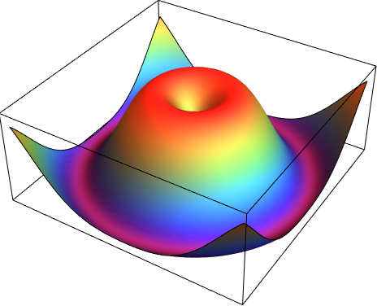
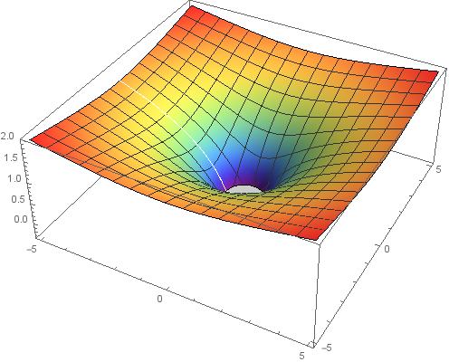
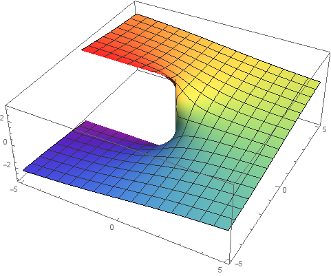
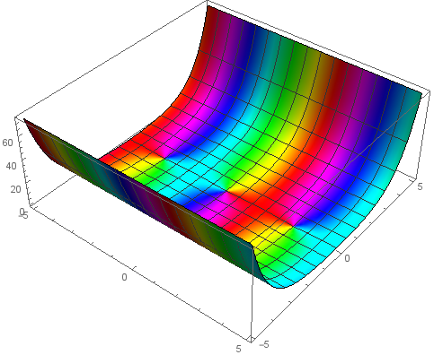

# Complex Function Visualization
#### See [this pdf](https://github.com/hanzhi713/Complex-Visualization/blob/master/Visualization%20of%20Complex%20Functions%20by%20Hanzhi%20Zhou.pdf) for some explanations.

## Visualizing *f: ℂ → ℝ*
Method: Plot like a two-variable real function *f: ℝ<sup>2</sup> → ℝ*
```mathematica
eqn[x_, y_] := Sin[Abs[x + I y]];
Plot3D[eqn[x, y], {x, -5, 5}, {y, -5, 5}, 
  PlotPoints -> 50, ColorFunction -> "Rainbow", Mesh ->None]
```
#### Graph of **_f(z) = sin(|z|)_**

## Visualizing *f: ℝ → ℂ*
Method: Plotting the real and imaginary part separately
```mathematica
eqn[x_] := E^(-I x)
Plot[{Re@eqn[x],Im@eqn[x]}, {x, -5, 5}, 
      PlotStyle -> Thick, PlotRange -> All, PlotPoints -> 50]
```
#### Graph of **_f(x) = e<sup>ix</sup>_**

## Visualizing *f: ℂ → ℂ*
### Method 1
Plotting the real and imaginary part separately
```mathematica
eqn[x_, y_] := Log[x + I y];
Plot3D[Re@eqn[x, y], {x, -5, 5}, {y, -5, 5}, 
  PlotPoints -> 100, ColorFunction -> "Rainbow"];
Plot3D[Im@eqn[x, y], {x, -5, 5}, {y, -5, 5}, 
  PlotPoints -> 100, ColorFunction -> "Rainbow"];
```

**The real part of** *f(z) = ln(z)*



**The imaginary part** of *f(z) = ln(z)*



### Method 2
Plotting the absolute value, representing the argument using color map
```mathematica
eqn[x_, y_] := Sin[x + I y];

ComplexFnPlot[f_, range_, options___] := 
    Block[{rangerealvar, rangeimagvar, g},
        g[r_, i_] := (f /. range[[1]] :> r + I i);
        Plot3D[Abs[g[rangerealvar, rangeimagvar]], 
            {rangerealvar, Re[range[[2]]], Re[range[[3]]]}, 
            {rangeimagvar, Im[range[[2]]], Im[range[[3]]]}, options, 
            
   ColorFunction -> (Hue[Mod[Arg[g[#1, #2]]/(2*Pi) + 1, 1]] &),
            ColorFunctionScaling -> False]];

ComplexFnPlot[eqn[Re@z, Im@z], {z, -5 - 5 I, 5 + 5 I}, PlotPoints -> 50]
```
#### Graph of *f(z) = sin(z)*


## Reference
https://mathematica.stackexchange.com/questions/3458/plotting-complex-quantity-functions